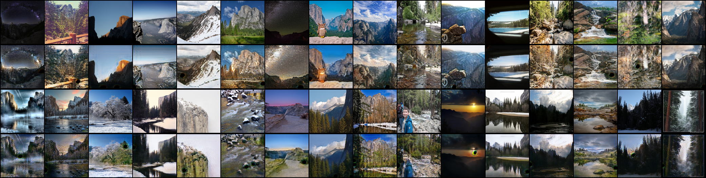

## Cycle GAN:

Cycle GAN is an architecture used in Image Translation to map a given image from a domain (Summer Images for e.g) to another domain (Winter Images). See the results below (30 epochs):

The following, is an implementation of the latter architecture. I am also attaching a set of usefull links:

- [The Original Paper](https://arxiv.org/pdf/1703.10593)
- [A Brief Explanatory Video](https://www.youtube.com/watch?v=-8hfnlxEPn4)
- [A Useful Article](https://medium.com/@chilldenaya/cyclegan-introduction-pytorch-implementation-5b53913741ca)
- [Kaggle Notebook (if you are too lazy to run the source code as I am :wink: )](https://www.kaggle.com/code/mohcenchouireb/cyclegan-using-pytorch)
