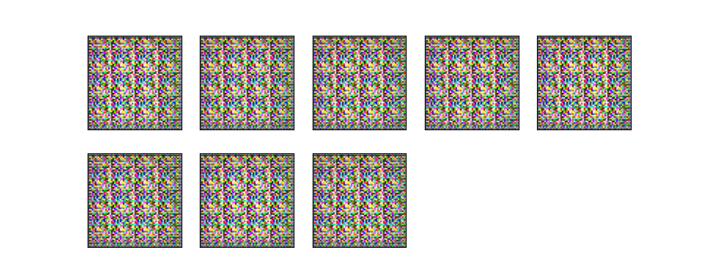
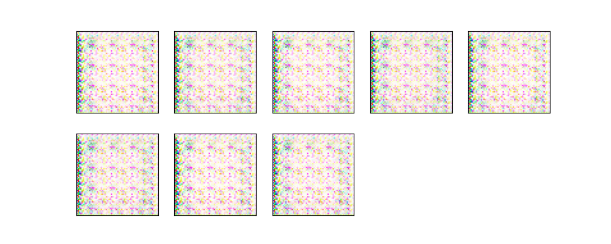
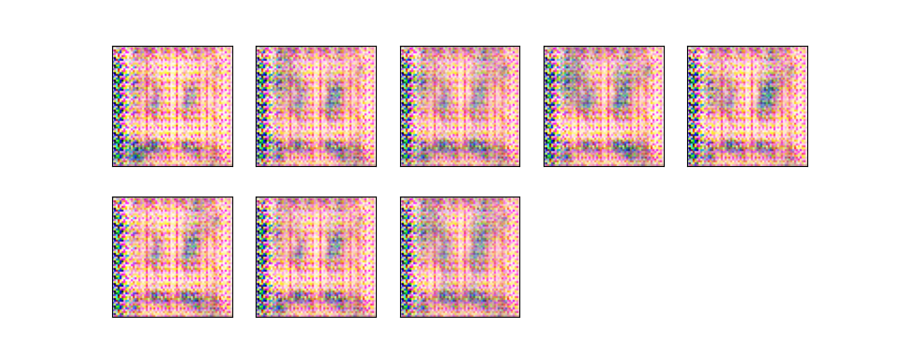
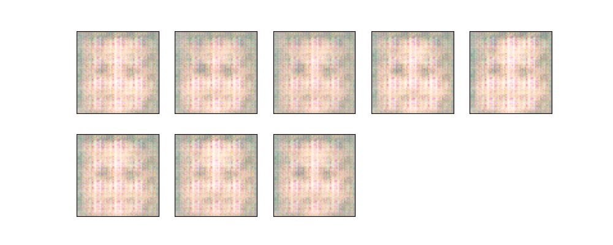
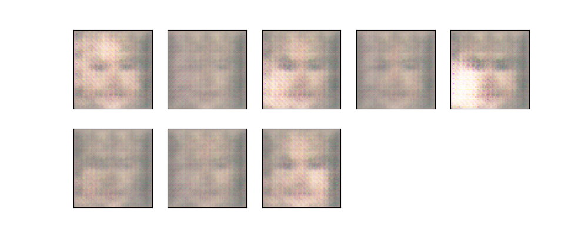
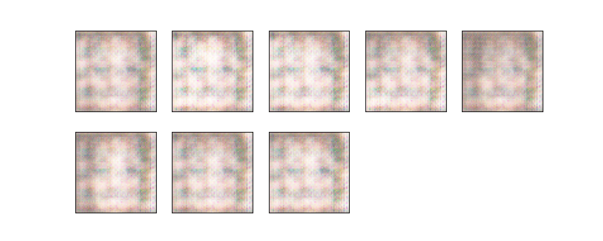
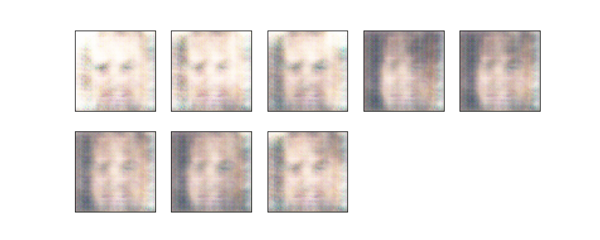
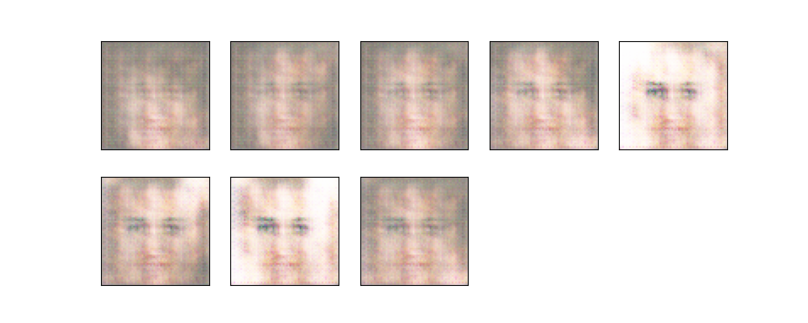
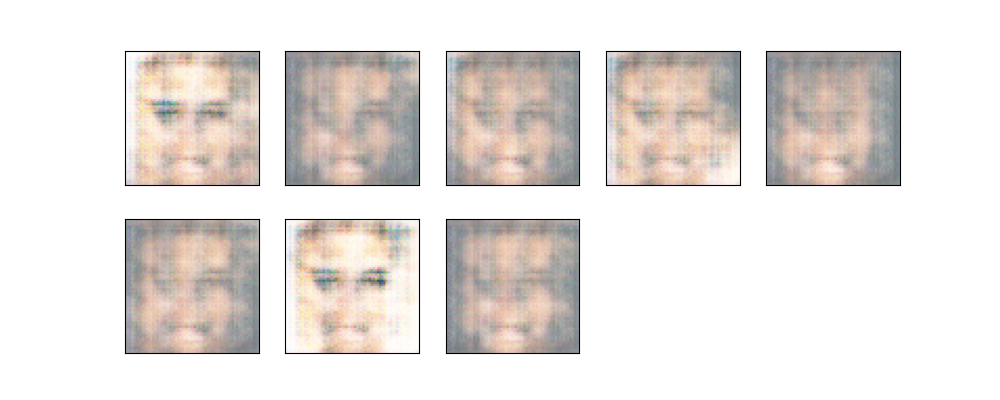
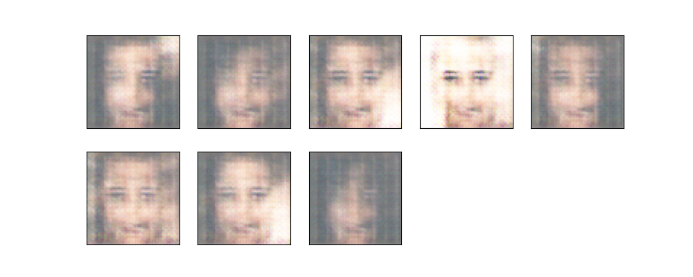

## Deep Convolutional GAN

[Original Paper](https://arxiv.org/pdf/1511.06434)

## Results:
| Epoch          | Image                            |
|----------------|----------------------------------|
| Epoch 0        |  |
| Epoch 5        |  |
| Epoch 10       |  |
| Epoch 15       |  |
| Epoch 20       |  |
| Epoch 25       |  |
| Epoch 30       |  |
| Epoch 35       |  |
| Epoch 40       |  |
| Epoch 45       |  |
