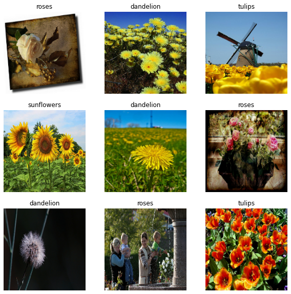
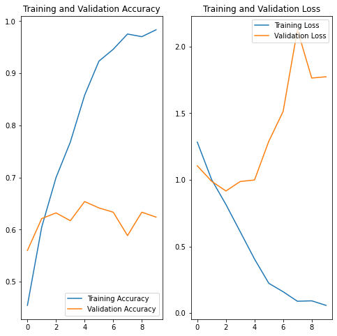
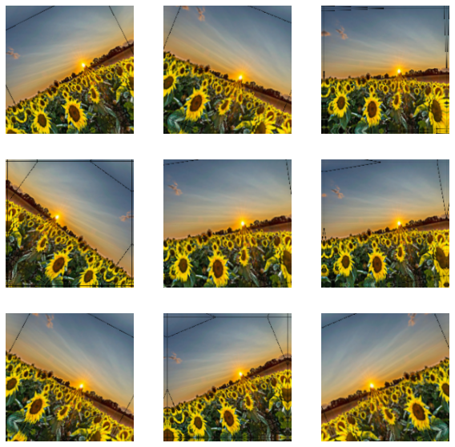

##### Copyright 2018 The TensorFlow Authors.


```python
#@title Licensed under the Apache License, Version 2.0 (the "License");
# you may not use this file except in compliance with the License.
# You may obtain a copy of the License at
#
# https://www.apache.org/licenses/LICENSE-2.0
#
# Unless required by applicable law or agreed to in writing, software
# distributed under the License is distributed on an "AS IS" BASIS,
# WITHOUT WARRANTIES OR CONDITIONS OF ANY KIND, either express or implied.
# See the License for the specific language governing permissions and
# limitations under the License.
```

# Image classification

<table class="tfo-notebook-buttons" align="left">
  <td>
    <a target="_blank" href="https://www.tensorflow.org/tutorials/images/classification">View on TensorFlow.org</a>
  </td>
  <td>
    <a target="_blank" href="https://colab.research.google.com/github/tensorflow/docs/blob/master/site/en/tutorials/images/classification.ipynb">Run in Google Colab</a>
  </td>
  <td>
    <a target="_blank" href="https://github.com/tensorflow/docs/blob/master/site/en/tutorials/images/classification.ipynb">View source on GitHub</a>
  </td>
  <td>
    <a href="https://storage.googleapis.com/tensorflow_docs/docs/site/en/tutorials/images/classification.ipynb">Download notebook</a>
  </td>
</table>

This tutorial shows how to classify images of flowers. It creates an image classifier using a `keras.Sequential` model, and loads data using `preprocessing.image_dataset_from_directory`. You will gain practical experience with the following concepts:

* Efficiently loading a dataset off disk.
* Identifying overfitting and applying techniques to mitigate it, including data augmentation and Dropout.

This tutorial follows a basic machine learning workflow:

1. Examine and understand data
2. Build an input pipeline
3. Build the model
4. Train the model
5. Test the model
6. Improve the model and repeat the process

## Import TensorFlow and other libraries


```python
import matplotlib.pyplot as plt
import numpy as np
import os
import PIL
import tensorflow as tf

from tensorflow import keras
from tensorflow.keras import layers
from tensorflow.keras.models import Sequential
from core.loggging import logger
```

## Download and explore the dataset

This tutorial uses a dataset of about 3,700 photos of flowers. The dataset contains 5 sub-directories, one per class:

```
flower_photo/
  daisy/
  dandelion/
  roses/
  sunflowers/
  tulips/
```


```python
from preparation.extract import FlowerExtract

dataset_url = "https://storage.googleapis.com/download.tensorflow.org/example_images/flower_photos.tgz"
data_dir = "data/processed"

logger.info("PREPARE ---> Starting data preparation for training ...")
data_processor = FlowerExtract(dataset_url, data_dir)

data_dir = data_processor.run()
logger.info(
    'PREPARE ---> Processed training data dir: {}'.format(data_dir))
```

    2020-11-13 00:45:55,230 root INFO PREPARE ---> Starting data preparation for training ...
    2020-11-13 00:45:57,997 root INFO collected: 3670
    2020-11-13 00:45:57,999 root INFO PREPARE ---> Processed training data dir: data/processed/flower_photos


After downloading, you should now have a copy of the dataset available. There are 3,670 total images:


```python
import pathlib

data_dir = pathlib.Path(data_dir)

image_count = len(list(data_dir.glob('*/*.jpg')))
print(image_count)
```

    3670


Here are some roses:


```python
roses = list(data_dir.glob('roses/*'))
PIL.Image.open(str(roses[0]))
```


    

    


```python
PIL.Image.open(str(roses[1]))
```


    

    


And some tulips:


```python
tulips = list(data_dir.glob('tulips/*'))
PIL.Image.open(str(tulips[0]))
```


    

    


```python
PIL.Image.open(str(tulips[1]))
```


    

    


# Load using keras.preprocessing

Let's load these images off disk using the helpful [image_dataset_from_directory](https://www.tensorflow.org/api_docs/python/tf/keras/preprocessing/image_dataset_from_directory) utility. This will take you from a directory of images on disk to a `tf.data.Dataset` in just a couple lines of code. If you like, you can also write your own data loading code from scratch by visiting the [load images](https://www.tensorflow.org/tutorials/load_data/images) tutorial.

## Create a dataset

Define some parameters for the loader:


```python
batch_size = 32
img_height = 180
img_width = 180
```

It's good practice to use a validation split when developing your model. Let's use 80% of the images for training, and 20% for validation.


```python
train_ds = tf.keras.preprocessing.image_dataset_from_directory(
  data_dir,
  validation_split=0.2,
  subset="training",
  seed=123,
  image_size=(img_height, img_width),
  batch_size=batch_size)
```

    Found 3670 files belonging to 5 classes.
    Using 2936 files for training.


```python
val_ds = tf.keras.preprocessing.image_dataset_from_directory(
  data_dir,
  validation_split=0.2,
  subset="validation",
  seed=123,
  image_size=(img_height, img_width),
  batch_size=batch_size)
```

    Found 3670 files belonging to 5 classes.
    Using 734 files for validation.


You can find the class names in the `class_names` attribute on these datasets. These correspond to the directory names in alphabetical order.


```python
class_names = train_ds.class_names
print(class_names)
```

    ['daisy', 'dandelion', 'roses', 'sunflowers', 'tulips']


## Visualize the data

Here are the first 9 images from the training dataset.


```python
import matplotlib.pyplot as plt

plt.figure(figsize=(10, 10))
for images, labels in train_ds.take(1):
  for i in range(9):
    ax = plt.subplot(3, 3, i + 1)
    plt.imshow(images[i].numpy().astype("uint8"))
    plt.title(class_names[labels[i]])
    plt.axis("off")
```


    

    


You will train a model using these datasets by passing them to `model.fit` in a moment. If you like, you can also manually iterate over the dataset and retrieve batches of images:


```python
for image_batch, labels_batch in train_ds:
  print(image_batch.shape)
  print(labels_batch.shape)
  break
```

    (32, 180, 180, 3)
    (32,)


The `image_batch` is a tensor of the shape `(32, 180, 180, 3)`. This is a batch of 32 images of shape `180x180x3` (the last dimension refers to color channels RGB). The `label_batch` is a tensor of the shape `(32,)`, these are corresponding labels to the 32 images. 

You can call `.numpy()` on the `image_batch` and `labels_batch` tensors to convert them to a `numpy.ndarray`.


## Configure the dataset for performance

Let's make sure to use buffered prefetching so you can yield data from disk without having I/O become blocking. These are two important methods you should use when loading data.

`Dataset.cache()` keeps the images in memory after they're loaded off disk during the first epoch. This will ensure the dataset does not become a bottleneck while training your model. If your dataset is too large to fit into memory, you can also use this method to create a performant on-disk cache.

`Dataset.prefetch()` overlaps data preprocessing and model execution while training. 

Interested readers can learn more about both methods, as well as how to cache data to disk in the [data performance guide](https://www.tensorflow.org/guide/data_performance#prefetching).


```python
AUTOTUNE = tf.data.experimental.AUTOTUNE

train_ds = train_ds.cache().shuffle(1000).prefetch(buffer_size=AUTOTUNE)
val_ds = val_ds.cache().prefetch(buffer_size=AUTOTUNE)
```

## Standardize the data

The RGB channel values are in the `[0, 255]` range. This is not ideal for a neural network; in general you should seek to make your input values small. Here, you will standardize values to be in the `[0, 1]` range by using a Rescaling layer.


```python
normalization_layer = layers.experimental.preprocessing.Rescaling(1./255)
```

Note: The Keras Preprocessing utilities and layers introduced in this section are currently experimental and may change.

There are two ways to use this layer. You can apply it to the dataset by calling map:


```python
normalized_ds = train_ds.map(lambda x, y: (normalization_layer(x), y))
image_batch, labels_batch = next(iter(normalized_ds))
first_image = image_batch[0]
# Notice the pixels values are now in `[0,1]`.
print(np.min(first_image), np.max(first_image)) 
```

    0.013725491 0.8985832


Or, you can include the layer inside your model definition, which can simplify deployment. Let's use the second approach here.

Note: you previously resized images using the `image_size` argument of `image_dataset_from_directory`. If you want to include the resizing logic in your model as well, you can use the [Resizing](https://www.tensorflow.org/api_docs/python/tf/keras/layers/experimental/preprocessing/Resizing) layer.

# Create the model

The model consists of three convolution blocks with a max pool layer in each of them. There's a fully connected layer with 128 units on top of it that is activated by a `relu` activation function. This model has not been tuned for high accuracy, the goal of this tutorial is to show a standard approach. 


```python
num_classes = 5

model = Sequential([
  layers.experimental.preprocessing.Rescaling(1./255, input_shape=(img_height, img_width, 3)),
  layers.Conv2D(16, 3, padding='same', activation='relu'),
  layers.MaxPooling2D(),
  layers.Conv2D(32, 3, padding='same', activation='relu'),
  layers.MaxPooling2D(),
  layers.Conv2D(64, 3, padding='same', activation='relu'),
  layers.MaxPooling2D(),
  layers.Flatten(),
  layers.Dense(128, activation='relu'),
  layers.Dense(num_classes)
])
```

## Compile the model

For this tutorial, choose the `optimizers.Adam` optimizer and `losses.SparseCategoricalCrossentropy` loss function. To view training and validation accuracy for each training epoch, pass the `metrics` argument.


```python
model.compile(optimizer='adam',
              loss=tf.keras.losses.SparseCategoricalCrossentropy(from_logits=True),
              metrics=['accuracy'])
```

## Model summary

View all the layers of the network using the model's `summary` method:


```python
model.summary()
```

    Model: "sequential"
    _________________________________________________________________
    Layer (type)                 Output Shape              Param #   
    =================================================================
    rescaling_1 (Rescaling)      (None, 180, 180, 3)       0         
    _________________________________________________________________
    conv2d (Conv2D)              (None, 180, 180, 16)      448       
    _________________________________________________________________
    max_pooling2d (MaxPooling2D) (None, 90, 90, 16)        0         
    _________________________________________________________________
    conv2d_1 (Conv2D)            (None, 90, 90, 32)        4640      
    _________________________________________________________________
    max_pooling2d_1 (MaxPooling2 (None, 45, 45, 32)        0         
    _________________________________________________________________
    conv2d_2 (Conv2D)            (None, 45, 45, 64)        18496     
    _________________________________________________________________
    max_pooling2d_2 (MaxPooling2 (None, 22, 22, 64)        0         
    _________________________________________________________________
    flatten (Flatten)            (None, 30976)             0         
    _________________________________________________________________
    dense (Dense)                (None, 128)               3965056   
    _________________________________________________________________
    dense_1 (Dense)              (None, 5)                 645       
    =================================================================
    Total params: 3,989,285
    Trainable params: 3,989,285
    Non-trainable params: 0
    _________________________________________________________________


## Train the model


```python
epochs=10
history = model.fit(
  train_ds,
  validation_data=val_ds,
  epochs=epochs
)
```

    Epoch 1/10
    92/92 [==============================] - 45s 490ms/step - loss: 1.2830 - accuracy: 0.4547 - val_loss: 1.1054 - val_accuracy: 0.5599
    Epoch 2/10
    92/92 [==============================] - 40s 433ms/step - loss: 1.0020 - accuracy: 0.6049 - val_loss: 0.9893 - val_accuracy: 0.6213
    Epoch 3/10
    92/92 [==============================] - 39s 428ms/step - loss: 0.8152 - accuracy: 0.6999 - val_loss: 0.9165 - val_accuracy: 0.6322
    Epoch 4/10
    92/92 [==============================] - 40s 430ms/step - loss: 0.6104 - accuracy: 0.7681 - val_loss: 0.9874 - val_accuracy: 0.6172
    Epoch 5/10
    92/92 [==============================] - 39s 426ms/step - loss: 0.4055 - accuracy: 0.8580 - val_loss: 0.9989 - val_accuracy: 0.6540
    Epoch 6/10
    92/92 [==============================] - 40s 431ms/step - loss: 0.2231 - accuracy: 0.9234 - val_loss: 1.2899 - val_accuracy: 0.6417
    Epoch 7/10
    92/92 [==============================] - 39s 426ms/step - loss: 0.1598 - accuracy: 0.9462 - val_loss: 1.5135 - val_accuracy: 0.6335
    Epoch 8/10
    92/92 [==============================] - 40s 430ms/step - loss: 0.0883 - accuracy: 0.9755 - val_loss: 2.1271 - val_accuracy: 0.5886
    Epoch 9/10
    92/92 [==============================] - 39s 427ms/step - loss: 0.0915 - accuracy: 0.9704 - val_loss: 1.7646 - val_accuracy: 0.6335
    Epoch 10/10
    92/92 [==============================] - 39s 428ms/step - loss: 0.0575 - accuracy: 0.9837 - val_loss: 1.7739 - val_accuracy: 0.6240


## Visualize training results

Create plots of loss and accuracy on the training and validation sets.


```python
acc = history.history['accuracy']
val_acc = history.history['val_accuracy']

loss = history.history['loss']
val_loss = history.history['val_loss']

epochs_range = range(epochs)

plt.figure(figsize=(8, 8))
plt.subplot(1, 2, 1)
plt.plot(epochs_range, acc, label='Training Accuracy')
plt.plot(epochs_range, val_acc, label='Validation Accuracy')
plt.legend(loc='lower right')
plt.title('Training and Validation Accuracy')

plt.subplot(1, 2, 2)
plt.plot(epochs_range, loss, label='Training Loss')
plt.plot(epochs_range, val_loss, label='Validation Loss')
plt.legend(loc='upper right')
plt.title('Training and Validation Loss')
plt.show()
```


    

    


As you can see from the plots, training accuracy and validation accuracy are off by large margin and the model has achieved only around 60% accuracy on the validation set.

Let's look at what went wrong and try to increase the overall performance of the model.

## Overfitting

In the plots above, the training accuracy is increasing linearly over time, whereas validation accuracy stalls around 60% in the training process. Also, the difference in accuracy between training and validation accuracy is noticeable—a sign of [overfitting](https://www.tensorflow.org/tutorials/keras/overfit_and_underfit).

When there are a small number of training examples, the model sometimes learns from noises or unwanted details from training examples—to an extent that it negatively impacts the performance of the model on new examples. This phenomenon is known as overfitting. It means that the model will have a difficult time generalizing on a new dataset.

There are multiple ways to fight overfitting in the training process. In this tutorial, you'll use *data augmentation* and add *Dropout* to your model.

## Data augmentation

Overfitting generally occurs when there are a small number of training examples. [Data augmentation](https://www.tensorflow.org/tutorials/images/data_augmentation) takes the approach of generating additional training data from your existing examples by augmenting them using random transformations that yield believable-looking images. This helps expose the model to more aspects of the data and generalize better.

You will implement data augmentation using experimental [Keras Preprocessing Layers](https://www.tensorflow.org/api_docs/python/tf/keras/layers/experimental/preprocessing/?version=nightly). These can be included inside your model like other layers, and run on the GPU.


```python
data_augmentation = keras.Sequential(
  [
    layers.experimental.preprocessing.RandomFlip("horizontal", 
                                                 input_shape=(img_height, 
                                                              img_width,
                                                              3)),
    layers.experimental.preprocessing.RandomRotation(0.1),
    layers.experimental.preprocessing.RandomZoom(0.1),
  ]
)
```

Let's visualize what a few augmented examples look like by applying data augmentation to the same image several times:


```python
plt.figure(figsize=(10, 10))
for images, _ in train_ds.take(1):
  for i in range(9):
    augmented_images = data_augmentation(images)
    ax = plt.subplot(3, 3, i + 1)
    plt.imshow(augmented_images[0].numpy().astype("uint8"))
    plt.axis("off")
```


    

    


You will use data augmentation to train a model in a moment.

## Dropout

Another technique to reduce overfitting is to introduce [Dropout](https://developers.google.com/machine-learning/glossary#dropout_regularization) to the network, a form of *regularization*.

When you apply Dropout to a layer it randomly drops out (by setting the activation to zero) a number of output units from the layer during the training process. Dropout takes a fractional number as its input value, in the form such as 0.1, 0.2, 0.4, etc. This means dropping out 10%, 20% or 40% of the output units randomly from the applied layer.

Let's create a new neural network using `layers.Dropout`, then train it using augmented images.


```python
model = Sequential([
  data_augmentation,
  layers.experimental.preprocessing.Rescaling(1./255),
  layers.Conv2D(16, 3, padding='same', activation='relu'),
  layers.MaxPooling2D(),
  layers.Conv2D(32, 3, padding='same', activation='relu'),
  layers.MaxPooling2D(),
  layers.Conv2D(64, 3, padding='same', activation='relu'),
  layers.MaxPooling2D(),
  layers.Dropout(0.2),
  layers.Flatten(),
  layers.Dense(128, activation='relu'),
  layers.Dense(num_classes)
])
```

## Compile and train the model


```python
model.compile(optimizer='adam',
              loss=tf.keras.losses.SparseCategoricalCrossentropy(from_logits=True),
              metrics=['accuracy'])
```


```python
model.summary()
```

    Model: "sequential_2"
    _________________________________________________________________
    Layer (type)                 Output Shape              Param #   
    =================================================================
    sequential_1 (Sequential)    (None, 180, 180, 3)       0         
    _________________________________________________________________
    rescaling_2 (Rescaling)      (None, 180, 180, 3)       0         
    _________________________________________________________________
    conv2d_3 (Conv2D)            (None, 180, 180, 16)      448       
    _________________________________________________________________
    max_pooling2d_3 (MaxPooling2 (None, 90, 90, 16)        0         
    _________________________________________________________________
    conv2d_4 (Conv2D)            (None, 90, 90, 32)        4640      
    _________________________________________________________________
    max_pooling2d_4 (MaxPooling2 (None, 45, 45, 32)        0         
    _________________________________________________________________
    conv2d_5 (Conv2D)            (None, 45, 45, 64)        18496     
    _________________________________________________________________
    max_pooling2d_5 (MaxPooling2 (None, 22, 22, 64)        0         
    _________________________________________________________________
    dropout (Dropout)            (None, 22, 22, 64)        0         
    _________________________________________________________________
    flatten_1 (Flatten)          (None, 30976)             0         
    _________________________________________________________________
    dense_2 (Dense)              (None, 128)               3965056   
    _________________________________________________________________
    dense_3 (Dense)              (None, 5)                 645       
    =================================================================
    Total params: 3,989,285
    Trainable params: 3,989,285
    Non-trainable params: 0
    _________________________________________________________________


```python
epochs = 15
history = model.fit(
  train_ds,
  validation_data=val_ds,
  epochs=epochs
)
```

    Epoch 1/15
    45/92 [=============>................] - ETA: 25s - loss: 1.4787 - accuracy: 0.3611

## Visualize training results

After applying data augmentation and Dropout, there is less overfitting than before, and training and validation accuracy are closer aligned. 


```python
acc = history.history['accuracy']
val_acc = history.history['val_accuracy']

loss = history.history['loss']
val_loss = history.history['val_loss']

epochs_range = range(epochs)

plt.figure(figsize=(8, 8))
plt.subplot(1, 2, 1)
plt.plot(epochs_range, acc, label='Training Accuracy')
plt.plot(epochs_range, val_acc, label='Validation Accuracy')
plt.legend(loc='lower right')
plt.title('Training and Validation Accuracy')

plt.subplot(1, 2, 2)
plt.plot(epochs_range, loss, label='Training Loss')
plt.plot(epochs_range, val_loss, label='Validation Loss')
plt.legend(loc='upper right')
plt.title('Training and Validation Loss')
plt.show()
```

## Predict on new data

Finally, let's use our model to classify an image that wasn't included in the training or validation sets.

Note: Data augmentation and Dropout layers are inactive at inference time.


```python
sunflower_url = "https://i.redd.it/g6avkbzjz8b51.jpg"
sunflower_path = tf.keras.utils.get_file('test_sun_4', origin=sunflower_url)

img = keras.preprocessing.image.load_img(
    sunflower_path, target_size=(img_height, img_width)
)
img_array = keras.preprocessing.image.img_to_array(img)
img_array = tf.expand_dims(img_array, 0) # Create a batch

predictions = model.predict(img_array)
score = tf.nn.softmax(predictions[0])

print(
    "This image most likely belongs to {} with a {:.2f} percent confidence."
    .format(class_names[np.argmax(score)], 100 * np.max(score))
)
```


```python

```
